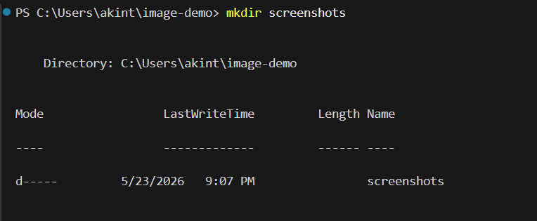
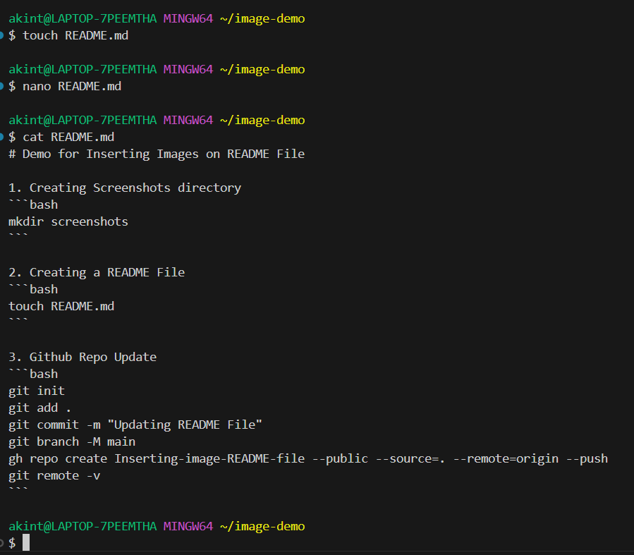
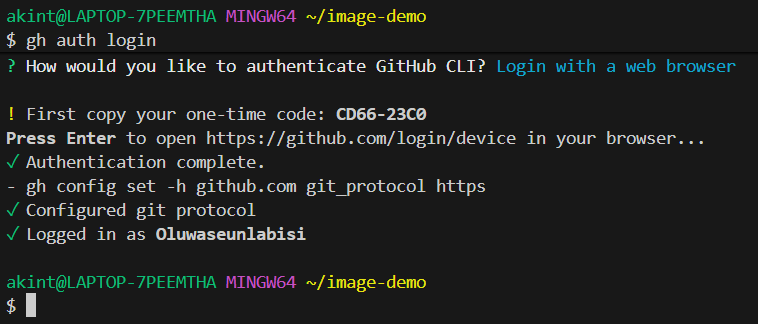
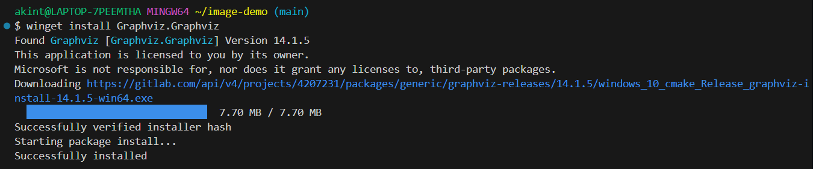
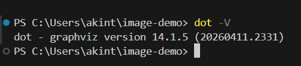
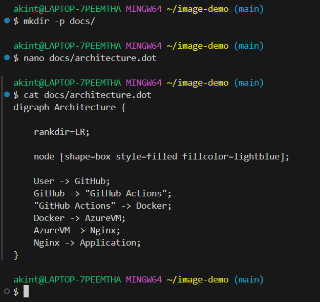
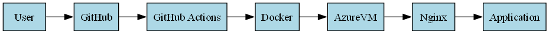

# Demo for Inserting Images on README File
Imagine this simple deployment flow:

* A developer pushes code to GitHub
* GitHub Actions builds a Docker image
* Docker deploys the app to a Linux VM
* Nginx serves the application

1. Creating Screenshots directory 
```bash
mkdir screenshots
```


2. Creating a README File  
```bash
touch README.md
```    


3. Github Repo Authentication
```bash
gh auth login
```


4. Github Repo Update
```bash
git init
git add .
git commit -m "Updating README File"
git branch -M main
gh repo create Inserting-image-README-file --public --source=. --remote=origin --push
git remote -v
```

5. Downloading, Installing and Verifying Graphviz Installation

Install:

```bash
winget install Graphviz.Graphviz
```


Verify:

```bash
dot -V
```



6. Creating Architecture Diagram

Open:

```bash
nano docs/architecture.dot
```

Paste:




Generate architecture image:

```bash
dot -Tpng docs/architecture.dot -o docs/architecture-diagram.png
```

Open image:

```bash
open docs/architecture-diagram.png
```
